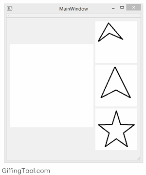

sketch-search
=============

Sketch-based Image Retrieval, based on the paper ["Sketch-Based Shape Retrieval" - SIGGRAPH 2012](http://cybertron.cg.tu-berlin.de/eitz/projects/sbsr/).

Original code from [mathiaseitz's imdb_framework](https://github.com/mathiaseitz/imdb_framework).

Only requirments are **OpenCV** and **Qt**. Original code needed boost for threading, here we are using OpenMP. Code is not fully optimized. A simple GUI demo and sample data are supplied.

###What it looks like

